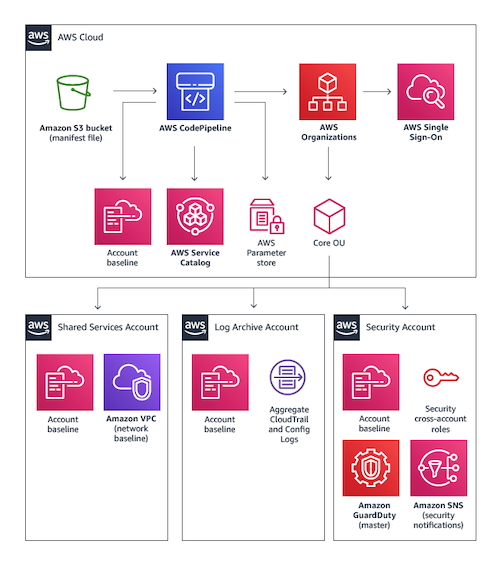
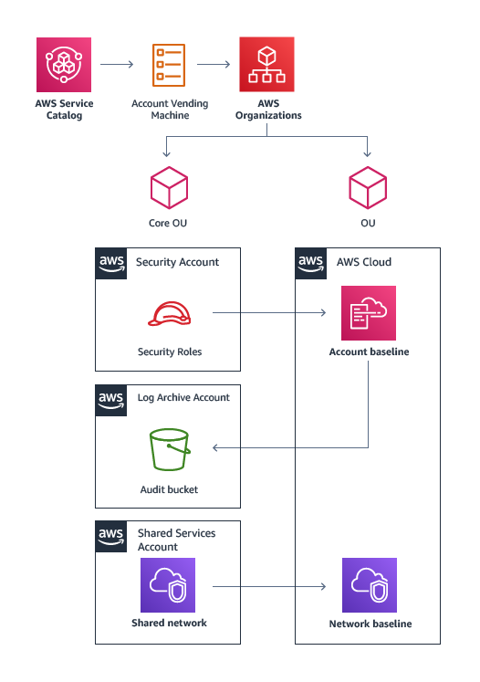
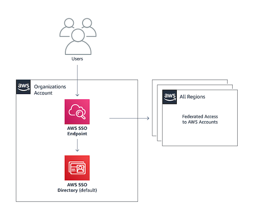
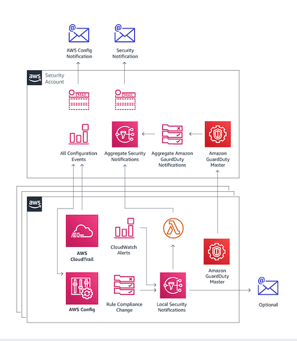

# Network Service Topology

This document describes the high‑level network structure and supporting services that the AWS Landing Zone module deploys. Each diagram below highlights a core part of the landing zone and the roles of its components.

## Multi‑Account Architecture

The foundation of the landing zone is a multi-account setup. Separate accounts provide logical isolation for security, logging, shared services and application workloads. This structure allows centralized governance while enabling teams to operate independently in their designated accounts.

## Account Vending Machine

The Account Vending Machine (AVM) automates creation of new AWS accounts. It applies a predefined networking baseline, places the account in the correct organizational unit and configures logging so that new accounts integrate seamlessly with the existing landing zone environment.

## User Access and Identity Management

User access is managed through centralized identity services. Cross-account roles and single sign-on simplify authentication to new accounts while enforcing least‑privilege permissions. Directory services can also be integrated for organizations that require it.

## Monitoring and Notifications

Monitoring components collect metrics and audit logs across all accounts. CloudWatch alarms and events notify administrators of important changes such as security group updates, root logins or policy changes.
